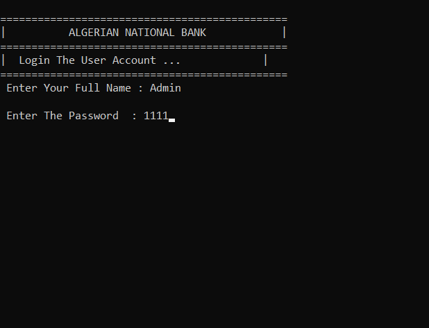
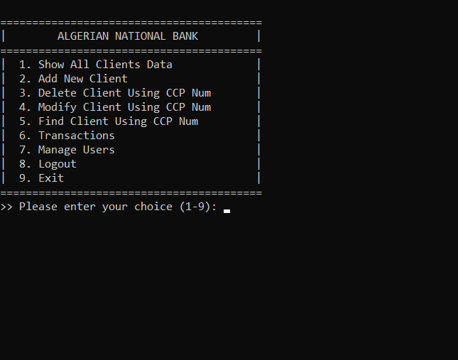
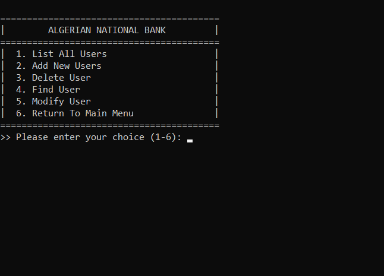
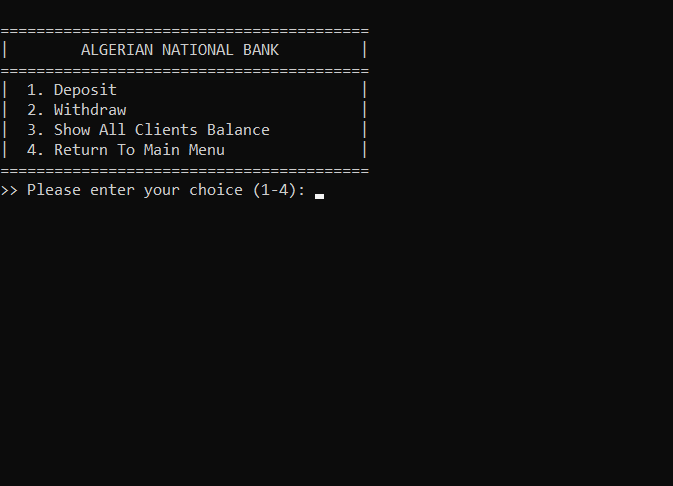

# 🏦 Algerian National Bank Simulator

 
 

A secure C++ console application simulating Algeria's national banking operations with CCP account management.

## 🌟 Featured Screenshots

| Login System | Main Menu |
|-------------|----------|
|  |  |

| User Management | Transactions |
|----------------|--------------|
|  |  |

## 🔥 Key Features

- **Authentic Algerian Banking**
  - CCP number validation
  - Dinar (DZD) currency handling
  - BNA-inspired interface

- **Multi-Level Security**
  - Admin (Full access)
  - Staff (Limited permissions)
  - Encrypted credential storage

- **Core Operations**
  - Client account management
  - Deposit/Withdrawal processing
  - Balance tracking

## 🚀 Quick Start
## Usage
- Use the default admin account (Username: Admin, Password: 1111, permission: -1(full access to all features of the app))
- Follow the on-screen menus to navigate through the system
- All data is saved in text files (`Clients.txt` and `Users.txt`)
